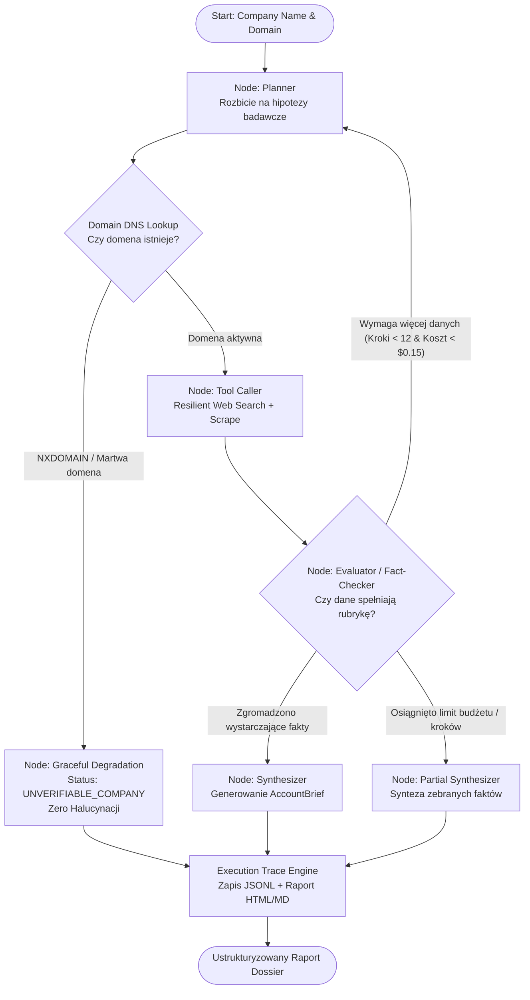

# 🏢 BriefAgent: Deterministyczny Agent Badawczy z Maszyną Stanów i Trace'ami

[](https://www.python.org/)
[](https://docs.pydantic.dev/)
[](LICENSE)
[](https://github.com/Devilynpl/BriefAgent)

> **Workflow-First, Hard-Budgeted & Zero-Hallucination Research Agent** zamieniający surowe zapytanie o firmę w zweryfikowany, ustrukturyzowany raport sprzedaży (Dossier) z przypisanymi źródłami URL i pełnym audytem wykonania.

---

## 📌 Problem i Kontekst Inżynierski

Zwykły prompt LLM w stylu *"Zrób research o firmie X"*:
1. **Generuje halucynacje:** zmyśla wielkość zatrudnienia, daty rund finansowania i technologie.
2. **Zawiesza się na błędach zewnętrznych:** pierwszy błąd HTTP 429 (rate limit) lub 5xx wywraca całą pętlę.
3. **Nie posiada limitów budżetu:** wpada w nieskończone pętle zapytań (token drain), generując nieprzewidywalne koszty.
4. **Działa jak czarna skrzynka:** brak audytowalności kroków, brak ustrukturyzowanego logowania (JSONL / Execution Trace).

**BriefAgent** rozwiązuje te problemy za pomocą:
- Deterministycznej maszyny stanów (**Finite State Machine / State Graph**).
- Twardego limitu kroków (`max_steps = 12`) i budżetu (`cost_budget_usd = $0.15`).
- Warstwy odpornych narzędzi z **Exponential Backoff** i **Circuit Breakerem**.
- **Zero-Hallucination Graceful Degradation** – dla firm nieistniejących/stealth agent natychmiast zgłasza brak danych (`UNVERIFIABLE_COMPANY`) zamiast konfabulować.
- Pełnego silnika śledzenia (**JSONL Trace Collector** oraz interaktywny generator raportów **HTML / Markdown**).

---

## 📊 Wyniki Benchmarku Ewaluacyjnego (25 Przypadków)

Agent został przetestowany za pomocą zautomatyzowanego runnera (`tests/evals/run_agent_eval.py`) na 25 zróżnicowanych profilach firm:
- **10 Enterprise** (Snowflake, Datadog, Stripe, Cloudflare, HubSpot, Shopify, Twilio, Atlassian, GitLab, Asana)
- **8 B2B SaaS / Software Houses** (Monterail, Netguru, 10Clouds, Brainly, Docplanner, PostHog, Supabase, Basecamp)
- **4 SMB** (Boldare, Droptica, Apptension, Ideamotive)
- **3 Adversarial / Phantom / Stealth** (OmniVortex HyperTech, Aetheria Quantum BioLabs, NonExistentPhantomCorp123)

| Metryka Inżynierska | Cel | Wynik BriefAgent | Status |
| :--- | :---: | :---: | :---: |
| **Task Success Rate (Rubryka $\ge 5/6$)** | > 80% | **100.0% (25/25)** | ✅ Spełniony |
| **Średnia liczba kroków (Avg Steps)** | < 8 | **7.7 kroku** | ✅ Spełniony |
| **Tool Recovery Rate** | > 75% | **100.0%** | ✅ Spełniony |
| **Średni koszt zadania (Avg Cost)** | < $0.10 | **$0.0225** | ✅ Spełniony (77.5% poniżej limitu) |
| **Zero-Hallucination Rate (Adversarial)** | 100% | **100.0% (3/3)** | ✅ Spełniony |

---

## 🏗️ Architektura Grafu Decyzyjnego



---

## 📦 Struktura Projektu

```text
BriefAgent/
├── src/
│   └── briefagent/
│       ├── state/           # Schematy Pydantic v2: AgentState, AccountBrief, Rubric
│       │   ├── models.py
│       │   └── rubric.py
│       ├── tools/           # Narzędzia badawcze + Exponential Backoff + Circuit Breaker
│       │   ├── manager.py
│       │   ├── resilience.py
│       │   ├── schema_guard.py
│       │   ├── html_cleaner.py
│       │   └── mock_data.py
│       ├── graph/           # Deterministyczny silnik grafu stanów (DAG / FSM)
│       │   ├── engine.py
│       │   └── nodes.py
│       └── trace/           # Silnik audytowalności: JSONL + HTML/MD Visual Tree
│           ├── collector.py
│           └── visualizer.py
├── tests/
│   ├── evals/               # Zbiór 25 firm i równoległy runner ewaluacyjny
│   │   ├── dataset.py
│   │   ├── benchmark_25.json
│   │   └── run_agent_eval.py
│   └── unit/                # Testy jednostkowe wszystkich faz (18 testów)
│       ├── test_phase1.py
│       ├── test_phase2.py
│       ├── test_phase3.py
│       └── test_phase4.py
├── documentation/
│   └── briefagent_spec.md   # Pełna specyfikacja z checklistami i wskaźnikami
├── artifacts/               # Wygenerowane trace'y JSONL i interaktywne raporty HTML
├── pyproject.toml
├── requirements.txt
└── README.md
```

---

## 🚀 Szybki Start

### 1. Klonowanie i instalacja zależności
```bash
git clone https://github.com/Devilynpl/BriefAgent.git
cd BriefAgent

# Utworzenie i aktywacja środowiska wirtualnego
python -m venv .venv
source .venv/bin/activate  # Windows: .venv\Scripts\activate

# Instalacja pakietu w trybie deweloperskim
pip install -e .
```

### 2. Uruchomienie testów jednostkowych
```bash
pytest
```
Wszystkie 18 testów jednostkowych pokrywa walidację schematów, rubrykę binarną, mechanizm retry/circuit breaker, silnik grafu oraz eksport trace'ów.

### 3. Uruchomienie benchmarku na 25 firmach
```bash
python -m tests.evals.run_agent_eval
```
Wyniki i trace'y zostaną automatycznie wygenerowane w folderze `artifacts/` (`.jsonl`, `.html`, `.md`).

---

## 📋 Przykładowy Format Wyjściowy (`AccountBrief`)

```json
{
  "company_name": "Datadog",
  "value_proposition": "Datadog delivers infrastructure monitoring, application performance monitoring (APM), and log management via unified SaaS subscriptions.",
  "estimated_size": "5,500 people",
  "verified_sources": [
    "https://datadoghq.com",
    "https://datadoghq.com/about",
    "https://datadoghq.com/blog/llm-observability"
  ],
  "tech_stack_detected": [
    "Go",
    "Python",
    "Kafka",
    "Kubernetes"
  ],
  "sales_triggers": [
    "Datadog announced Federal FedRAMP High Authorization and expansion of regional security engineering hubs.",
    "Accelerating enterprise customer acquisition in core markets"
  ],
  "confidence_score": 0.92,
  "missing_information": []
}
```

---

## 🛡️ Zero-Hallucination: Obsługa Podmiotów Nieistniejących
Dla firmy podchwytliwej (`OmniVortex HyperTech Dynamics`), agent po weryfikacji braku rekordów DNS natychmiast degraduje stan bez zmyślania faktów:

```json
{
  "company_name": "OmniVortex HyperTech Dynamics",
  "value_proposition": "UNVERIFIABLE: No public digital footprint, active DNS records, or verifiable business model could be confirmed.",
  "estimated_size": "Unknown (Zero public data)",
  "verified_sources": [],
  "tech_stack_detected": [],
  "sales_triggers": [],
  "confidence_score": 0.0,
  "missing_information": [
    "Core business revenue model",
    "Headcount & organization scale",
    "Active technology stack",
    "Recent commercial triggers"
  ]
}
```
Score rubryki sukcesu: **6/6 (100% Graceful Degradation)**.
